# Residex: Incident Management Workshop

> **Vibe Coding: Mission Critical Edition**

Welcome to the workshop! You are the **Lead Engineer** for **Residex**, the incident management system used by luxury high-rise residential towers.

---

> ⚠️ **Before You Begin: Software Engineering Fundamentals**
>
> AI coding assistants are powerful, but they work best when YOU understand core software engineering principles. Before diving in, familiarize yourself with these foundational concepts:
>
> | Principle | What It Means | Why It Matters for AI-Assisted Dev |
> |-----------|---------------|-----------------------------------|
> | **KISS** | Keep It Simple, Stupid | Tell the AI to use simple solutions; avoid over-engineering |
> | **DRY** | Don't Repeat Yourself | Ask AI to identify and extract repeated code |
> | **SOLID** | Single responsibility, Open/closed, Liskov substitution, Interface segregation, Dependency inversion | Guide AI to write maintainable, modular code |
> | **YAGNI** | You Aren't Gonna Need It | Prevent AI from adding unnecessary features |
> | **Separation of Concerns** | Each module handles one thing | Structure your prompts around single responsibilities |
>
> **Recommended Reading:**
> - [SOLID Principles Explained](https://www.digitalocean.com/community/conceptual-articles/s-o-l-i-d-the-first-five-principles-of-object-oriented-design)
> - [Clean Code Summary](https://gist.github.com/wojteklu/73c6914cc446146b8b533c0988cf8d29)
> - [The Pragmatic Programmer Tips](https://pragprog.com/tips/)
>
> **Remember:** AI amplifies your skills. The better you understand these principles, the better you can guide the AI to write quality code.

---

> 🔀 **Git & Version Control Fundamentals**
>
> This workshop uses Git and GitHub extensively. If you're new to version control, take a moment to understand these core concepts:
>
> | Concept | What It Is | Why It Matters |
> |---------|------------|----------------|
> | **Repository (Repo)** | A project folder tracked by Git | Stores all your code and its history |
> | **Commit** | A snapshot of your code at a point in time | Creates checkpoints you can return to |
> | **Branch** | A parallel version of your code | Lets you work on features without breaking main code |
> | **Fork** | Your personal copy of someone else's repo | Lets you contribute to projects you don't own |
> | **Pull Request (PR)** | A request to merge your changes | How you contribute code back to a project |
> | **Clone** | Download a repo to your local machine | Gets the code onto your computer |
> | **Push** | Upload your commits to GitHub | Shares your changes with others |
> | **Pull** | Download changes from GitHub | Gets others' changes onto your machine |
>
> **Essential Git Commands:**
> ```bash
> git status          # See what's changed
> git add .           # Stage all changes for commit
> git commit -m "msg" # Save a snapshot with a message
> git push            # Upload to GitHub
> git pull            # Download from GitHub
> git checkout -b X   # Create and switch to branch X
> git log --oneline   # See commit history
> ```
>
> **The Golden Rules:**
> 1. **Commit often** - Small, frequent commits are easier to understand and revert
> 2. **Write good commit messages** - Future you will thank present you
> 3. **Never commit to main** - Always use feature branches
> 4. **Pull before you push** - Avoid merge conflicts
>
> **Recommended Resources:**
> - [Git Handbook (GitHub)](https://docs.github.com/en/get-started/using-git/about-git)
> - [Learn Git Branching (Interactive)](https://learngitbranching.js.org/)
> - [Oh Shit, Git!?! (Fixing Mistakes)](https://ohshitgit.com/)
> - [GitHub Flow Guide](https://docs.github.com/en/get-started/quickstart/github-flow)
> - [Atlassian Git Tutorials](https://www.atlassian.com/git/tutorials)

---

## The Scenario

**Your Users:**
- **Tenants** use the mobile app (phone mockup on the right) to report urgent issues like leaks, fires, and security concerns
- **Building Managers** use the dashboard to monitor incidents and dispatch help in real-time

**The Crisis:**
Building managers are reporting **"Ghost Incidents"** - they receive angry calls from tenants about emergencies, but the dashboard shows nothing until they refresh the page multiple times. In a real emergency, this delay could be catastrophic.

**Your Mission:**
1. Fix the critical sync bug
2. Secure the application architecture
3. Add proper resolution workflow
4. Implement automatic tenant notifications
5. Build your own feature and contribute it back!

---

## Getting Started

### 1. Fork the Repository

Go to the original repo on GitHub and click **"Fork"** to create your own copy.


### 2. Clone Your Fork

```bash
git clone https://github.com/<YOUR_USERNAME>/residex.git
cd residex
```

### 3. Create a Feature Branch

**Important:** Never work directly on `main`. Create a branch for your work:

```bash
git checkout -b workshop/your-name
```

### 4. Install & Run

```bash
npm install
npm run dev
```

### 5. Open the Dashboard

Visit [http://localhost:3000](http://localhost:3000)

**What You'll See:**
- **Left Side**: Manager Dashboard with incident feed and stats
- **Right Side**: Collapsible phone mockup (click the "Tenant App" tab to show/hide)

---

## Git Workflow

Throughout the workshop, you'll follow a professional Git workflow:


**After each exercise:**
```bash
git add .
git commit -m "Exercise X: description of what you did"
```

**After Exercise 4:** Create a PR to YOUR fork's main branch.

**After Exercise 5:** Create a PR to the ORIGINAL repo with your new feature!

---

## Exercise 1: The Ghost Incident

**Difficulty:** Easy | **Time:** 5-10 minutes | **Skill:** Debugging Server Actions

### The Problem

1. Open the phone mockup (Tenant App) on the right side
2. Fill out the form and submit a new incident (e.g., "Water leak in Apt 404")
3. Look at the Manager Dashboard on the left

**What happens?** Nothing. The incident doesn't appear.

You have to manually refresh the entire page to see the new incident. In an emergency where seconds matter, this is unacceptable.

### The Root Cause

```mermaid
sequenceDiagram
    participant Tenant
    participant Server
    participant Dashboard

    Tenant->>Server: Submit Incident
    Server->>Server: Add to database ✅
    Note over Dashboard: Still showing old data ❌
    Dashboard-->>Dashboard: Cache is stale
    Tenant->>Dashboard: Why isn't it showing?!
```



Next.js Server Actions modify data on the server, but the client doesn't know the data changed. The UI is "stale" - it shows old data until you force a refresh.

### Your Task

1. Open `app/actions.ts`
2. Find the `submitIncident` function
3. Notice the comment: `// BUG: Missing revalidatePath('/')`

**Prompt to Claude:**
> "The submitIncident function doesn't update the UI after adding a new incident. Add revalidatePath to refresh the page data after submission. Also fix the same issue in resolveIncident."

### Success Criteria

- [ ] Submit an incident from the phone mockup
- [ ] It appears instantly on the dashboard (no refresh needed)
- [ ] Resolving an incident also updates instantly

### Commit Your Work

```bash
git add .
git commit -m "Exercise 1: Fix ghost incident bug with revalidatePath"
```

### What You Learned

- `revalidatePath()` tells Next.js to re-fetch data for a specific route
- Server Actions need explicit cache invalidation
- This is a common "gotcha" in Next.js App Router

---

## Exercise 2: Security Architecture

**Difficulty:** Medium | **Time:** 10-15 minutes | **Skill:** Code Organization & Security

### The Problem

Open `app/actions.ts` and look at the code structure:

```typescript
// Public action - any tenant can call this
export async function submitIncident(formData: FormData) { ... }

// Admin action - only managers should call this
export async function resolveIncident(id: number) { ... }
```

**The Risk:** Both functions live in the same file with no access control. A malicious tenant could potentially call `resolveIncident` directly and close other people's incidents.

### Your Task

Separate the code by privilege level:


1. Create `lib/services/tenant.ts` - Public functions (incident submission)
2. Create `lib/services/admin.ts` - Protected functions (resolve, delete, assign)
3. Keep `app/actions.ts` as thin wrappers that call these services

**Prompt to Claude:**
> "Refactor app/actions.ts for better security. Create lib/services/tenant.ts for public incident submission logic. Create lib/services/admin.ts for admin-only operations like resolving incidents. The actions.ts file should be simple wrappers that call these services."

### Bonus Challenge

Add a mock authentication check:

> "Add a check to admin.ts that verifies the user is an admin before allowing incident resolution. For now, use a mock isAdmin() function that returns true."

### Success Criteria

- [ ] `lib/services/tenant.ts` contains incident creation logic
- [ ] `lib/services/admin.ts` contains resolve/admin logic
- [ ] `app/actions.ts` is now a thin wrapper
- [ ] (Bonus) Admin functions check for authorization

### Commit Your Work

```bash
git add .
git commit -m "Exercise 2: Refactor actions for security separation"
```

### What You Learned

- Separation of concerns improves security
- Server-side code organization matters
- Defense in depth: multiple layers of protection

---

## Exercise 3: Resolution Workflow

**Difficulty:** Medium | **Time:** 15-20 minutes | **Skill:** Forms & Data Management

### The Problem

Currently, clicking "Resolve" just silently changes the status. There's no record of:
- **What** was done to fix it
- **Who** resolved it
- **When** it was resolved

This is a problem for accountability. If a tenant calls back asking "Who fixed my leak?", the manager has no information.

### Your Task

Create a proper resolution workflow:


1. When clicking "Resolve", show a small form/modal
2. Capture a **resolution note** (e.g., "Replaced faulty pipe in unit 404")
3. Save the **resolver name** and **timestamp**
4. Display this information on the resolved incident card

**Prompt to Claude:**
> "When a manager clicks the resolve button, show a modal or inline form asking for a resolution note. Save the note along with who resolved it (use 'John Doe' as the mock user) and the current timestamp. Display this resolution info on the incident card when it's resolved."

### Success Criteria

- [ ] Clicking resolve opens a form/modal for the resolution note
- [ ] Submitting saves the note, resolver name, and timestamp
- [ ] Resolved incidents display: "Resolved by John Doe at 3:45 PM - Fixed the leak"
- [ ] The form can be cancelled without resolving

### Commit Your Work

```bash
git add .
git commit -m "Exercise 3: Add resolution workflow with notes"
```

### What You Learned

- Modal/form patterns in React
- Enriching data models with metadata
- Creating audit trails for accountability

---

## Exercise 4: Automatic Tenant Notification

**Difficulty:** Medium | **Time:** 15-20 minutes | **Skill:** Workflows & User Feedback

### The Problem

When a manager resolves an incident, the tenant has no idea. They reported "Water leak in Apt 404" and then... silence.

- Did anyone see my report?
- Is someone coming?
- Was it fixed?

The tenant is left in the dark, which leads to frustrated calls to the front desk.

### Your Task

When an incident is resolved, **automatically notify the tenant**:


1. Create a `sendNotification()` function that logs/mocks sending a message
2. Call it automatically when an incident is resolved
3. Show a **toast notification** on the dashboard: "Tenant notified successfully"
4. Add a **"Notified" badge** to the incident card

**Prompt to Claude:**
> "When an incident is marked as resolved, automatically send a notification to the tenant. Create a mock sendNotification function that logs the message to the console. Show a toast notification on the dashboard confirming the tenant was notified. Add a 'Notified' badge or icon to the resolved incident card."

### Success Criteria

- [ ] Resolving an incident triggers the notification automatically
- [ ] Console shows: "Notification sent to tenant: Your incident #X has been resolved"
- [ ] A toast appears on the dashboard confirming notification was sent
- [ ] The incident card shows both "Resolved" and "Notified" indicators

### Commit Your Work

```bash
git add .
git commit -m "Exercise 4: Add automatic tenant notification on resolve"
```

### What You Learned

- Chaining actions (resolve → notify)
- Toast notification patterns
- Visual feedback for background operations
- Building complete user workflows

---

## Create Your First Pull Request

You've completed the core exercises! Now let's create a PR to your own fork.


### 1. Push Your Branch

```bash
git push origin workshop/your-name
```

### 2. Create the PR

1. Go to your fork on GitHub: `https://github.com/<YOUR_USERNAME>/residex`
2. Click **"Compare & pull request"**
3. Set the base branch to `main` (your fork's main)
4. Title: `Workshop Exercises 1-4: [Your Name]`
5. Description: Summarize what you implemented
6. Click **"Create pull request"**

### 3. Merge It!

Since this is your own fork, go ahead and merge the PR to your main branch.

---

## Exercise 5: Your Feature Contribution

**Difficulty:** Open-ended | **Time:** 20-30 minutes | **Skill:** Feature Design & LLM-Assisted Development

### The Challenge

Now it's YOUR turn to innovate! You'll learn how to properly build features using AI coding assistants like Claude Code - the same workflow used by professional developers.

### The LLM-Assisted Development Workflow


---

### Step 1: Create a New Branch

```bash
git checkout main
git pull origin main
git checkout -b feature/your-feature-name
```

---

### Step 2: Choose Your Feature

Pick one of these ideas, or come up with your own:

| Feature Idea | Description |
|--------------|-------------|
| **Incident Priority Escalation** | Auto-escalate to Critical if not resolved in 10 minutes |
| **Search & Filter** | Add search box and filter buttons (All/Open/Resolved) |
| **Incident Categories** | Add color-coded categories (Plumbing, Electrical, Security) |
| **Resolution Templates** | Quick-select common resolutions |
| **Incident Timeline** | Show history: Created → Updated → Resolved → Notified |
| **Statistics Panel** | Show charts: incidents by type, avg resolution time |
| **Tenant Feedback** | Let tenants rate the resolution (1-5 stars) |
| **Export to CSV** | Download incident reports |
| **Your Own Idea!** | What would YOU want in an incident system? |

---

### Step 3: Write a Mini-PRD (Product Requirements Document)

Before coding, write a short specification. This is **context engineering** - giving the AI the information it needs to help you effectively.

**Template:**

```markdown
## Feature: [Name]

### What it does
[2-3 sentences describing the feature]

### Why it's useful
[The problem it solves for users]

### Acceptance Criteria
- [ ] [Specific behavior 1]
- [ ] [Specific behavior 2]
- [ ] [Specific behavior 3]

### Technical Notes
- Files likely affected: [e.g., actions.ts, IncidentCard.tsx]
- New components needed: [e.g., FilterBar, SearchInput]
- Data changes: [e.g., new field on incident object]
```

**Example Mini-PRD:**

```markdown
## Feature: Search & Filter

### What it does
Add a search box and filter buttons to the dashboard so managers
can quickly find specific incidents by keyword or status.

### Why it's useful
When there are many incidents, managers waste time scrolling.
They need to find specific incidents quickly during emergencies.

### Acceptance Criteria
- [ ] Search box filters incidents by description or location
- [ ] Filter buttons: All, Open, Resolved
- [ ] Filters update the list in real-time (no page refresh)
- [ ] Clear button resets all filters

### Technical Notes
- Files likely affected: app/page.tsx, components/IncidentCard.tsx
- New components needed: FilterBar.tsx, SearchInput.tsx
- Data changes: None (filtering is client-side)
```

---

### Step 4: Break Into Tasks

Decompose your feature into small, specific tasks. This helps Claude (and you) stay focused.

**Example Task Breakdown:**

```markdown
## Tasks for Search & Filter Feature

1. Create FilterBar component with All/Open/Resolved buttons
2. Create SearchInput component with search icon
3. Add filter state to dashboard page
4. Implement filter logic to show/hide incidents
5. Implement search logic to match description/location
6. Add clear button to reset filters
7. Style components to match existing design
```

---

### Step 5: Context Engineering - The Right Way to Prompt

**Bad Prompt (vague, no context):**
> "Add search to the dashboard"

**Good Prompt (specific, contextual):**
> "I'm adding a Search & Filter feature to the Residex incident dashboard.
>
> **Current state:** The dashboard shows all incidents in a list. There's no way to filter or search.
>
> **Goal:** Add a FilterBar component with three buttons (All, Open, Resolved) and a SearchInput component.
>
> **Files to reference:**
> - `app/page.tsx` - the main dashboard
> - `components/IncidentCard.tsx` - the incident display component
>
> **Task 1:** Create the FilterBar component with styled buttons that match the existing Tailwind design. It should accept `activeFilter` and `onFilterChange` props.
>
> Please start by reading the existing files to understand the patterns, then implement the FilterBar component."

**Key Context Engineering Principles:**

| Principle | Why It Matters |
|-----------|----------------|
| **Be specific** | "Add a button" vs "Add a blue primary button in the header" |
| **Provide file references** | Claude can read the actual code to match patterns |
| **One task at a time** | Smaller tasks = better results |
| **Ask to plan first** | "Read the files and propose an approach before coding" |
| **State the goal** | What should the end result look like? |

---

### Step 6: Ask Claude to Plan First

Before implementing, ask Claude to analyze and plan:

> "Before writing any code, please:
> 1. Read the relevant files (page.tsx, IncidentCard.tsx)
> 2. Identify the existing patterns and styles
> 3. Propose an implementation approach
> 4. List the specific changes you'll make
>
> I'll review your plan before we proceed."

This prevents wasted effort and catches misunderstandings early.

---

### Step 7: Iterative Development

Work through your tasks one at a time:


**After each task:**
- Test the change in the browser
- Check for console errors
- Verify it matches the existing style
- Commit if it works: `git add . && git commit -m "Add FilterBar component"`

---

### Step 8: Test Your Complete Feature

Before pushing, verify everything works:

- [ ] No errors in the browser console
- [ ] Feature behaves as specified in your PRD
- [ ] UI matches the existing Residex design
- [ ] All acceptance criteria are met
- [ ] Works with both light and dark themes

---

### Step 9: Commit & Push

```bash
git add .
git commit -m "Feature: [Brief description of your feature]"
git push origin feature/your-feature-name
```

---

### Step 10: Create a PR to the Original Repo

This is the real deal - contributing to open source!


1. Go to the **original repo**: `https://github.com/<ORIGINAL_OWNER>/residex`
2. Click **"New pull request"**
3. Click **"compare across forks"**
4. Set:
   - Base repository: `<ORIGINAL_OWNER>/residex` (base: `main`)
   - Head repository: `<YOUR_USERNAME>/residex` (compare: `feature/your-feature-name`)
5. Write a great PR description:

```markdown
## Feature: [Your Feature Name]

### What it does
[Describe the feature in 2-3 sentences]

### Why it's useful
[Explain the value this adds to Residex]

### Screenshots
[Add screenshots if it's a UI feature]

### How to test
1. [Step 1]
2. [Step 2]
3. [Expected result]
```

6. Click **"Create pull request"**

---

### LLM Development Cheat Sheet

| Do This | Not This |
|---------|----------|
| Write a mini-PRD first | Jump straight to "build X" |
| Break into small tasks | Ask for entire feature at once |
| Provide file references | Assume Claude knows the codebase |
| Ask to plan before coding | Skip planning, start implementing |
| Test after each task | Wait until the end to test |
| Describe issues specifically | Say "it doesn't work" |
| Commit working increments | Make one giant commit |

### What You Learned

- **Planning before coding** - Mini-PRDs focus your work and Claude's assistance
- **Context engineering** - How to give AI the right information
- **Task decomposition** - Breaking features into manageable pieces
- **Iterative development** - Build, test, refine in small cycles
- **Open source contribution** - The full workflow from idea to merged PR

---

## Wrap Up

Congratulations! You've completed the **Vibe Coding: Mission Critical** workshop!

### What You Built

| Exercise | Feature | Real-World Impact |
|----------|---------|-------------------|
| 1. Ghost Incident | Real-time sync | Managers see incidents instantly |
| 2. Security Architecture | Privilege separation | Protected admin operations |
| 3. Resolution Workflow | Audit trail | Accountability & documentation |
| 4. Auto-Notification | Tenant communication | Happy tenants, fewer calls |
| 5. Your Feature | Your innovation! | Your contribution to the project |

### Key Takeaways

1. **Server Actions need cache invalidation** - Always `revalidatePath()` after mutations
2. **Separate code by privilege level** - Public vs Admin code should be isolated
3. **Capture metadata** - Who, what, when creates accountability
4. **Close the loop** - Notify users when their issues are resolved
5. **LLM-Assisted Development** - Plan first, provide context, iterate in small steps
6. **Contribute back** - Open source makes everyone better

### Your Git Journey Today


---

**Happy Vibe Coding!**

*This is enterprise development - where good code saves time, and great contributions help everyone.*
